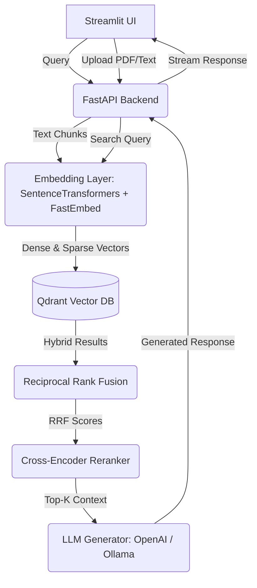

<div align="center">
  <h1>🧠 Hybrid RAG Engine</h1>
  <p>
    <strong>A production-ready Hybrid Retrieval-Augmented Generation (RAG) system built to showcase advanced AI engineering and modern search architectures.</strong>
  </p>

  <!-- Badges -->
  <p>
    
    
    
    
    
    
    
    
  </p>
</div>

---

## 📖 Overview

The **Hybrid RAG Engine** is an advanced AI search and generation pipeline designed to overcome the limitations of standard semantic search. By combining the deep semantic understanding of dense embeddings with the exact keyword matching of sparse vectors, this system provides highly accurate context retrieval. It further refines results using Reciprocal Rank Fusion (RRF) and Cross-Encoder reranking, ultimately feeding the most relevant context into a modular LLM generation layer to produce precise, hallucination-free answers.

---

## ✨ Key Features

- **Hybrid Search Capabilities:** Seamlessly combines semantic meaning (Dense Retrieval via `all-MiniLM-L6-v2`) with exact keyword matching (Sparse Retrieval via `FastEmbed/SPLADE`) for unparalleled search accuracy.
- **Reciprocal Rank Fusion (RRF):** Intelligently merges and normalizes results from both dense and sparse retrieval methods to form a unified, highly relevant candidate pool.
- **Cross-Encoder Reranking:** Employs advanced cross-encoder models (`ms-marco-MiniLM-L-6-v2`) to re-evaluate and rerank the retrieved chunks, ensuring maximum contextual relevance before generation.
- **Modular LLM Generation:** Designed with a flexible backend supporting drop-in integration for cloud providers like OpenAI (`gpt-4o-mini`) or local execution via Ollama (e.g., `llama3`).
- **Automated RAGAS Evaluation:** Built-in scripts utilizing the RAGAS framework to quantitatively benchmark the pipeline against hallucination (Faithfulness), Answer Relevance, and Context Precision.
- **Production-Ready & Dockerized:** Offers a 1-click deployment experience using Docker Compose, encapsulating the frontend, API, and vector database environments.

---

## 🧠 Why Hybrid RAG?

Standard RAG pipelines typically rely solely on dense embeddings (vector search). While excellent for understanding meaning, they often fail at exact keyword matches, acronyms, or specific ID lookups. Our Hybrid RAG Engine solves this by implementing a multi-stage retrieval pipeline:

- **Dense Retrieval:** Uses embedding models to capture the semantic meaning of the text. It excels at answering conceptual questions (e.g., "How does the system scale?").
- **Sparse Retrieval:** Uses term-frequency-based models (like BM25 or SPLADE) to match exact words. It excels at finding specific names, IDs, or domain-specific jargon.
- **Hybrid Search:** Executes both Dense and Sparse queries simultaneously against the Qdrant Vector Database, ensuring no relevant document is left behind.
- **Reciprocal Rank Fusion (RRF):** An algorithmic approach to combine the rankings from both searches. It scores documents based on their positions in multiple lists, bringing the most consistently highly-ranked documents to the top without needing to tune weights.
- **Cross-Encoder Reranking:** While dense and sparse models independently score query-to-document relevance efficiently, a Cross-Encoder passes both the query and document through the transformer simultaneously. This is computationally heavier but significantly more accurate, making it the perfect final filter for our top-K results.

---

## 🏛️ Architecture

### ASCII Flow Diagram
```text
  [Streamlit UI]
       |  ^
 Query |  | Response
       v  |
  [FastAPI Backend] -----------------------------+
       |                                         |
       | 1. Embed Query                          | 5. Top-K Context
       v                                         |
  [Embedding Layer]                              |
  (Dense + Sparse)                               |
       |                                         |
       | 2. Vectors                              |
       v                                         |
  [Qdrant Vector DB]                             |
       |                                         |
       | 3. Dense & Sparse Results               |
       v                                         |
  [Reciprocal Rank Fusion]                       |
       |                                         |
       | 4. Merged Candidates                    |
       v                                         |
  [Cross-Encoder Reranker] ----------------------+
       |
       | 6. Final Context + Prompt
       v
  [LLM Generator (OpenAI/Ollama)]
```

### Mermaid Diagram


---

## 🔄 End-to-End Pipeline

1. **Ingestion**: Documents (PDFs, text files) are uploaded via the Streamlit frontend, sent to FastAPI, and chunked. Each chunk is processed by two models: a Dense embedding model for semantics and a Sparse embedding model (SPLADE) for exact keywords. Both vectors are stored natively in Qdrant.
2. **Retrieval**: When a user asks a question, the query undergoes the identical dual-embedding process. Qdrant performs a concurrent hybrid search, returning two separate lists of top matches (semantic and lexical).
3. **Fusion (RRF)**: The backend combines the two result lists using Reciprocal Rank Fusion. This algorithmic approach eliminates the need to manually guess weights for dense vs. sparse scores, reliably producing a unified, high-quality candidate list.
4. **Reranking**: A Cross-Encoder model evaluates the query against each candidate chunk simultaneously. Unlike bi-encoders (dense embeddings), cross-encoders score true contextual relevance with deep cross-attention, filtering out false positives.
5. **Generation**: The absolute best chunks are injected into a structured LLM prompt. The generator synthesizes a grounded answer, streaming it back to the user via the FastAPI-Streamlit connection.

---

## 🛠️ Tech Stack & Performance

| Layer | Technology | Purpose & Performance Notes |
|-------|------------|-----------------------------|
| **Frontend** | **Streamlit** | Rapid prototyping of chat and upload UI. Extremely fast time-to-market. |
| **API Backend** | **FastAPI** | High-performance, async REST endpoints. Crucial for non-blocking I/O during concurrent embedding and LLM API calls. |
| **Dense Embeddings** | **`all-MiniLM-L6-v2`** | Fast, lightweight semantic representations. Runs efficiently on CPU, avoiding strict GPU requirements while maintaining high accuracy. |
| **Sparse Embeddings** | **`FastEmbed` (SPLADE)** | Keyword-level precision matching. Unlike standard BM25, SPLADE learns representations and handles synonym expansion exceptionally well. |
| **Vector DB** | **Qdrant** | Chosen for native, high-performance support of both dense and sparse vectors. Rust-based engine ensures sub-millisecond retrieval. |
| **Reranker** | **`ms-marco-MiniLM`** | Deep cross-attention contextual scoring. Computationally heavier than dense models but acts as the perfect, highly-accurate final filter. |
| **LLM** | **OpenAI / Ollama** | Flexible generation layer. Allows seamless swapping between high-capability cloud models (GPT-4o-mini) and private, offline local models (Llama 3). |
| **Deployment** | **Docker Compose** | Isolated, reproducible container orchestration. Ensures the pipeline behaves exactly the same on any host machine. |

---

## 📁 Repository Structure

```text
hybrid-rag-engine/
├── backend/                  # FastAPI Application Layer
│   ├── main.py               # Application entrypoint and API routing
│   ├── retriever.py          # Qdrant client, Dense/Sparse embedding generation, and RRF logic
│   ├── reranker.py           # Cross-Encoder model implementation and scoring
│   ├── generator.py          # LLM integration (OpenAI API and Ollama clients)
│   └── parser.py             # Document chunking, cleaning, and text extraction logic
├── frontend/                 # Streamlit UI
│   └── app.py                # Chat interface, message history, and file upload components
├── evaluation/               # Benchmarking Suite
│   └── eval.py               # RAGAS metrics implementation for automated testing
├── docker-compose.yml        # Multi-container orchestration (UI, API, and Qdrant DB)
├── requirements.txt          # Python dependencies for the environment
└── README.md                 # Project documentation
```

---

## 🚀 Quick Start (Docker)

1. **Clone the repository.**
2. **Create the environment file before starting Docker:**
   ```bash
   cp .env.example .env
   ```
   This creates the required Docker environment file from the provided template. If you want to override defaults for your machine, edit `.env` before continuing.
3. **Start the containers:**
   ```bash
   docker compose up --build -d
   ```
4. **Access the Application:**
   - **Frontend UI:** `http://localhost:8501`
   - **FastAPI Docs:** `http://localhost:8000/docs`
   - **Qdrant DB (internal):** `http://localhost:6333`

*(Note: On the first run, it may take a few minutes for the backend container to download the embedding and reranking models from HuggingFace.)*

## 🧪 Evaluation & Benchmarking

We use **RAGAS** to evaluate the pipeline.

1. Ensure the API is running locally (`http://localhost:8000`).
2. Set your OpenAI API Key (required for RAGAS evaluation models):
   ```bash
   export OPENAI_API_KEY=your-api-key
   ```
3. Run the evaluation script:
   ```bash
   cd evaluation
   pip install -r requirements.txt
   python eval.py
   ```
4. A report (`eval_report.json`) will be generated detailing Faithfulness, Answer Relevancy, Context Precision, and Context Recall.

## 🔧 Configuration

The application now reads its runtime settings from a centralized configuration module and a shared `.env` file. Use [.env.example](.env.example) as the starting point, then adjust values for your environment.

## 🔧 Running without API Keys (Local LLM)

By default, the backend generator points to an `ollama` endpoint. Ensure you have Ollama installed locally and run:
```bash
ollama run llama3
```
Then update `docker-compose.yml` `LLM_BASE_URL` to point to your host machine's Ollama instance (e.g., `http://host.docker.internal:11434/v1`).
