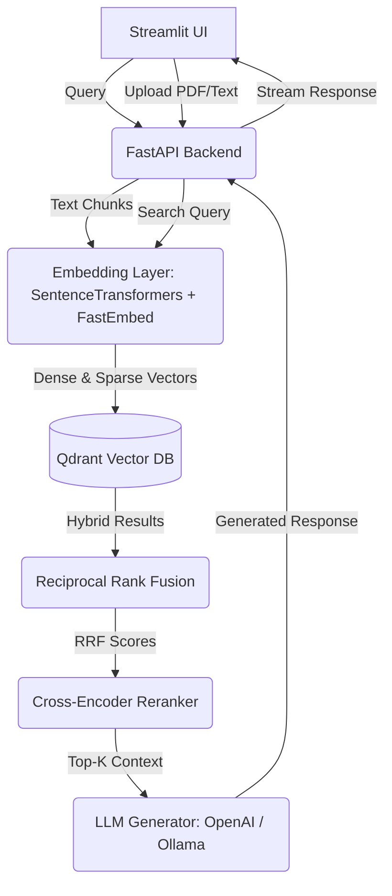

# Portfolio-Grade Hybrid RAG Pipeline

A production-ready Hybrid Retrieval-Augmented Generation (RAG) system built to showcase advanced AI engineering skills. It integrates Dense + Sparse vector retrieval, Reciprocal Rank Fusion (RRF), Cross-Encoder reranking, and a modular LLM generation layer.

## 🏛️ Architecture



## 🚀 Features

- **Hybrid Search**: Combines semantic meaning (Dense via `all-MiniLM-L6-v2`) with keyword exactness (Sparse via `FastEmbed/SPLADE`).
- **Reciprocal Rank Fusion**: Merges results from both dense and sparse retrieval to form a highly relevant candidate pool.
- **Cross-Encoder Reranking**: Uses `ms-marco-MiniLM-L-6-v2` to rerank chunks for maximal relevance.
- **Modular Generation**: Drop-in support for OpenAI (`gpt-4o-mini`) or local Ollama endpoints (e.g., `llama3`).
- **Automated Evaluation**: Includes a script utilizing RAGAS to benchmark hallucination (Faithfulness), relevance, and context precision.
- **Dockerized**: 1-click deploy using Docker Compose.

## 🛠️ Quick Start (Docker)

1. **Clone the repository.**
2. **Start the containers:**
   ```bash
   docker-compose up --build -d
   ```
3. **Access the Application:**
   - **Frontend UI:** `http://localhost:8501`
   - **FastAPI Docs:** `http://localhost:8000/docs`
   - **Qdrant DB (internal):** `http://localhost:6333`

*(Note: On the first run, it may take a few minutes for the backend container to download the embedding and reranking models from HuggingFace.)*

## 🧪 Evaluation & Benchmarking

We use **RAGAS** to evaluate the pipeline.

1. Ensure the API is running locally (`http://localhost:8000`).
2. Set your OpenAI API Key (required for RAGAS evaluation models):
   ```bash
   export OPENAI_API_KEY=your-api-key
   ```
3. Run the evaluation script:
   ```bash
   cd evaluation
   pip install -r requirements.txt
   python eval.py
   ```
4. A report (`eval_report.json`) will be generated detailing Faithfulness, Answer Relevancy, Context Precision, and Context Recall.

## 📁 Directory Structure
- `/backend`: FastAPI application, document parsers, embedders, retriever (Qdrant), reranker, and generator.
- `/frontend`: Streamlit dashboard.
- `/evaluation`: RAGAS benchmarking script.
- `/docker-compose.yml`: Multi-container setup.

## 🔧 Running without API Keys (Local LLM)
By default, the backend generator points to an `ollama` endpoint. Ensure you have Ollama installed locally and run:
```bash
ollama run llama3
```
Then update `docker-compose.yml` `LLM_BASE_URL` to point to your host machine's Ollama instance (e.g., `http://host.docker.internal:11434/v1`).
